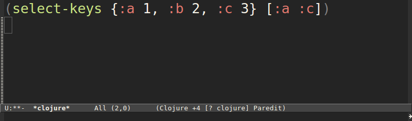

% Clojure at Revelytix
% Nate Young
% September 5, 2012

## Reve-what?

[http://www.revelytix.com](http://www.revelytix.com)

## Offices 

- Baltimore
- St. Louis

> - Golden Valley, MN

## Company

- ~30 employees
- Distributed Information Management
- Semantic Technology at scale

> - RDF, SPARQL

## RDF

~~~~{.nt}
<http://example.com/Shakespeare> <http://purl.org/dc/elements/1.1/creator> <http://example.com/Hamlet> .
~~~~

~~~~{.nt}
<http://example.com/Hamlet> <http://purl.org/dc/elements/1.1/title> "Hamlet" .
~~~~

## SPARQL

~~~~{.sparql}
PREFIX dc: <http://purl.org/dc/elements/1.1/>

SELECT ?person
WHERE {
  ?person dc:creator ?work .
  ?work dc:title "Hamlet"
}
~~~~

> - Joins. Lots of Joins

# Cast of Characters

## Founder

- Michael Lang
- Founded MetaMatrix 

> - Robert Scanlon
> - Senior VP of Engineering
> - Wrangled developers at MetaMatrix
> - 100+ commits

## Developers

- Alex Miller
- Chief Architect at MetaMatrix
- Java, Databases, Concurrency
- All-around smart guy
- Likes nachos

> - Strange Loop, ClojureWest, Lambda Jam

## Developers

- David McNeil
- No Clojure or Lisp experience prior (that I'm aware of)
- A 10x programmer

## Developers

- Ryan Senior
- OCaml, Smalltalk, Scheme

## Developers

- Myself
- Young, motivated, cheap
- Common Lisp, Haskell

## Developers

- Have since added 4 more

# The Products

## Federated Query

- issue multiple queries
- uncoordinated responses
- combine results relationally
- stream response to user
- SPARQL Protocol Everywhere

> - Relational is King

## SPARQL Endpoints

## Architecture

# Early Tech Choices

## Deciding

- The team knew it _didn't_ want Java

## Tools

- Emacs
- Slime/Swank

~~~~{.lisp}
(setq swank-clojure-classpath '("~/clojure/clojure.jar" "~/clojure-contrib/clojure-contrib.jar" "~/swank-clojure/swank-clojure.jar"))
~~~~

~~~~{.shell}
$ lein swank
M-x slime-connect
~~~~

~~~~{.lisp}
M-x clojure-jack-in
~~~~

> - nREPL

## Tools

- Maven
- Leiningen _1.7.1_
- Hg

# Emacs

## Baseline

- Emacs Starter Kit [https://github.com/technomancy/emacs-starter-kit/](https://github.com/technomancy/emacs-starter-kit/)
- ELPA
- Paredit is killer _(now essential)_

## Working in Emacs

## Working in Emacs

- C-x C-e

## Working in Emacs

## Working in Emacs

- C-u C-x C-e

> - This works for _everything_

## Working in Emacs

- REPL-driven development has nothing on this
- Heavily influenced later decisions

> - Cannot overstate how enamored we were
> - Seriously, we loved it
> - Loved it
> - So hard
> - _Must_ be able to print it into your buffer and then evaluate it again

## What We Don't Use

- Swank CDT [http://georgejahad.com/clojure/swank-cdt.html](http://georgejahad.com/clojure/swank-cdt.html)
- Historical

~~~~{.clojure}
(defmacro dbg [x]
  (let [ns *ns*]
    `(let [x# ~x]
       (println (str ~ns) ":" '~x "=")
       (pprint x#)
       (if (meta#)
         (do (println "with meta")
             (pprint (meta x#))))
       x#)))
~~~~

## What We Don't Like

- Easy to overdef your Clojure "image"

> - Leads to test failures
> - Dr. Scheme

----------

# Build Tools

## Maven

- First build tool
- Forked clojure-maven-plugin

~~~~
mvn clojure:swank -Pswank
mvn clojure:test
mvn assembly:assembly
~~~~

- ANTLR Plugin
- Scripts to invoke mvn deploy:deploy-file

## Leiningen

- Hooks

~~~~{.clojure}
(defn rm-target [task & [project & _ :as args]]
  (delete-file-recursively (file (:root project) "target") false)
  (apply task args))

(add-hook #'leiningen.clean/clean rm-target)
~~~~

- ANTLR
- Build distribution

~~~~{.clojure}
  :pkg [;;include       excludes?                           dest                                  opt-map?
        ["lib/*.jar"    ["common-*" "hsqldb-*"]             "lib/ext/"]
        ["lib/common-*"                                     "lib/"]
        ["lib/hsqldb-*"                                     "lib/drivers/"]
        ["src/dist/*"   ["**/.hidden" "**/*.sh"]            ""]
        ["src/dist/examples/employees/db/hsql/bin/*.sh"     "examples/employees/db/hsql/bin/"     {:filemode "755"}]
        ["src/main/resources/demo/*"                        "examples/demo/"]
        ["target/license_info.txt"                          "docs/"]]
~~~~

- Deploy (added to lein later)
- Check for Licenses

> - Compiledeps

## In the End

- Maybe Ant was what we wanted?
- Lancet

# Compiledeps

## Don't Distribute .clj

- Standalone Server
- `:aot` + `:omit-source` right?

> - CLJ-322
> 

## Build Steps

- lein deps
- lein compiledeps
- lein compile

## Compile Dependencies

- Built on maven-dependency-tree plugin
- mvn dependency:tree
- lein printdeps

~~~~
revelytix:spyder:1.4.7-SNAPSHOT:INCLUDED
`- clj-http:clj-http:0.2.1
   |- org.clojure:clojure:1.4.0
   |- org.apache.httpcomponents:httpclient:4.1.1
   |- commons-codec:commons-codec:1.6
   `- commons-io:commons-io:1.4
~~~~

- "Compile" the artifact's dependency prior to compiling itself
- Walk from the leaves up

~~~~{.clojure}
'(clojure, httpclient, commons-codec, commons-io, clj-http, spyder)
~~~~

## "Recompile" a jar

- List nses to compile from *.clj entries in jar
- Explode jar in to a temp directory
- Place the exploded jar and all dependencies below it on classpath of forked JVM proc
- Call `clojure.core/compile` per ns
- Roll temp directory back into a jar
- Install locally with a "-compiled" classifier

~~~~
Starting with org.clojure clojure 1.4.0
Copying 1 file to /home/n/revelytix/spyder/lib/compiled
org.apache.httpcomponents httpclient 4.1.1 ...no clj files found, not modifying jar
Copying 1 file to /home/n/revelytix/spyder/lib/compiled
commons-codec commons-codec 1.6 ...no clj files found, not modifying jar
Copying 1 file to /home/n/revelytix/spyder/lib/compiled
commons-io commons-io 1.4 ...no clj files found, not modifying jar
Copying 1 file to /home/n/revelytix/spyder/lib/compiled
clj-http clj-http 0.2.1 ...compiling
Copying 1 file to /home/n/revelytix/spyder/lib/compiled
Compiling clj-http.client
Compiling clj-http.cookies
Compiling clj-http.core
Compiling clj-http.util
Updating jar: /home/n/revelytix/spyder/lib/compiled/clj-http-0.2.1.jar
installing...
~~~~

## Loose Ends

- Won't recompile a jar it doesn't find any .clj files in
- Won't recompile nses when a newer .class file already exists
- Will used a cached -compiled artifact if one exists

~~~~
clj-http clj-http 0.2.1 ...found
Copying 1 file to /home/n/revelytix/spyder/lib/compiled
~~~~

> - Special exceptions for Clojure itself and 2 namespaces in Clojure Contrib

> - `clojure.contrib.javadoc`, `clojure.contrib.probabilities.random.examples-monte-carlo`

## Compiling is in the Details

- Lots and lots will hork your build

> - technomancy pushes a new release
> - Nearest neighbor
> - Artifact scope
> - Non-jar artifacts
> - compiledeps has seen 29 releases

## Unsatisfied

- We still have foreign .class files

~~~~
target/
`-- classes
    |-- clojure
    |   `-- tools
    |       |-- logging$eval42.class
    |       |-- logging$eval42$fn__43.class
    |       |-- logging$eval42$fn__48.class
    |       |-- logging$eval54.class
    |       `-- logging$eval54$reify__55.class
    `-- revelytix
~~~~

## Unsatisfied

> - No other project in the world seems to need this

# The Easy Stuff

## Data Structures

- No XML! (easy to take its absence for granted)
- Tree manipulation
- Records

## Interop - Calling Us

- Java interface to our Engine
- Tomcat War

## Interop - We'll call you

- Parsing
- ForkJoin, `java.util.concurrent`
- Hadoop, Cascading

# The Hard Stuff

## Contrib

- lost in the desert
- last holdouts were `clojure.contrib.lazy-xml` and `clojure.contrib.command-line`
- Ryan Senior did a lot of work on its replacement, `data.xml`
- Still haven't replaced `command-line`

## Clojure Migrations

- 1.2.0 -> 1.2.1

> - stop leaking PermGen (Alex Miller)

- 1.2.1 -> 1.3.0

> - rip out contrib for good (painful)

- 1.3.0 -> 1.4.0

> - weekend in a hammock

## Naming

- `QueryProcessor`
- `revelytix.spyder.query.*`
- `(defn doathing [& args]`

> - `(defn doathing-direct [& args]`
> - `(defn doathing* [& args]`
> - `(defn doathing2 [& args]`
> - `(defn doathing+ [& args]`

## Organization

- Communication among developers
- Duplication

## Laziness

- In the presence of side effects
- ResultSets & Database Connections

~~~~{.clojure}
(defn fetch-results [query]
  (with-open [connection (DriverManager/getConnection url properties)
              stmt (.prepareStatement connection query)
              rs (.executeQuery stmt)]
    (resultset-seq rs)))

(do-something (fetch-results query))
;; => java.sql.SQLException 
~~~~

~~~~{.clojure}
(let [connection (DriverManager/getConnection url properties)
      stmt (.prepareStatement connection query)]
  (lazy-cat
   (resultset-seq (.executeQuery stmt))
   (do (.close connection) nil)))
~~~~

## Laziness

- 'Ere a lazy seq might go...
- Exceptions (not thrown where they occurred)
- Profiling (methods inherit the costs of the lazy-seq's they were passed)
- Dynamic Variables & Bindings

## XML

- Writing XML in a Lazy fashion

## Records

- We loved them but...
- defrecord2

~~~~{.clojure}
(new-query-frame {:source "PERSON", :alias "P"})
;; => (new-query-frame {:source "PERSON", :alias "P"})
~~~~

~~~~{.clojure}
(new-query-frame old-frame {:alias "P2"})
;; => (new-query-frame {:source "PERSON", :alias "P2"})
~~~~

- `*strict-field-checks*`
- `clojure.pprint/simple-dispatch`
- Pattern Matching (matchure)
- Zippers

## Unnecessary?

- Improvements
- Factory Methods
- Reader Literals

## Code Rot

- It came from 2010
- Plus: just learning RDF and SemTech
- Plus: just learning Clojure
- Easy to spot

> - Many more type annotations
> - Many more protocols

## Testing

- clojure.test
- Midje?
- We use diff

# Questions?
