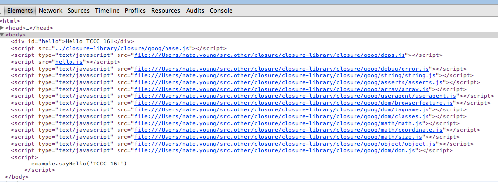
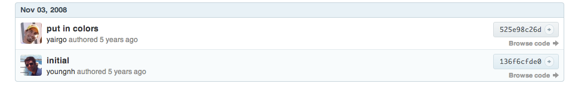

% Making Massive Apps Mini: Google's Closure Compiler
% Nate Young
% April 5, 2014

# Hello Whole Program Optimization

# hello.js

~~~ { .javascript }
goog.provide('example');

goog.require('goog.dom');

example.sayHello = function(message) {
    goog.dom.getElement('hello').innerHTML = 'Hello ' + message;
};
~~~~~~~~~~

# hello.html

~~~ { .html }
<html>
  <head>
    <title>Example: Hello World</title>
  </head>
  <body>
    

    
    
    

  </body>
</html>
~~~~~~~~~~

# What the...

> - 14(!) extra `

  </body>
</html>
~~~~~~~~~~

> - removed two `<script>` tags
> - use compiler output file

# What the...

`$ cat compile`

~~~
#!/bin/bash

python ../closure-library/closure/bin/calcdeps.py \
  --path ../closure-library \
  --input hello.js \
  --compiler_jar ../closure-compiler/build/compiler.jar \
  --output_mode compiled \
  --compiler_flags="--compilation_level=ADVANCED_OPTIMIZATIONS" \
  --compiler_flags="--define=goog.userAgent.ASSUME_WEBKIT=true" \
  > hello-compiled.js
~~~~~~~~~~

# No, really, what the...

`$ ls -lah`

~~~
drwxr-xr-x   6 nate.young  2023218408   204B Apr  4 21:05 .
drwxr-xr-x  11 nate.young  2023218408   374B Apr  4 20:54 ..
-rwxr-xr-x   1 nate.young  2023218408   289B Apr  4 21:04 compile
-rw-r--r--   1 nate.young  2023218408   1.4K Apr  4 21:05 hello-compiled.js
-rw-r--r--   1 nate.young  2023218408   226B Apr  4 21:01 hello.html
-rw-r--r--   1 nate.young  2023218408   191B Apr  4 21:05 hello.js
~~~~~~~~~~

# Last Chance

`$ $EDITOR compile`

~~~
...
  --compiler_flags="--define=goog.userAgent.ASSUME_WEBKIT=true" \
  > hello-compiled.js
~~~~~~~~~~

# Last Chance

`$ ls -lah`

~~~
-rw-r--r--   1 nate.young  2023218408    61B Apr  4 21:11 hello-compiled.js
~~~~~~~~~~

> - huzzah!

# Last Chance

`$ cat hello-compiled.js`

~~~ { .javascript }
document.getElementById("hello").innerHTML="Hello TCCC 16!";
~~~~~~~~~~

> - good show!

# What is Closure?

- A library

> - jQuery, YUI, Dojo, qooxdoo
> - but, still...

# What is Closure?

- A minifier

> - JSMIN, YUI, lots of websites
> - but, still...

# What is Closure?

- CoffeeScript showed me the light

> - ClojureScript, Roy, alt-js

# What is Closure?

A compiler that turns code into JavaScript, when that code is, well, JavaScript

> - oh, plus a templating library

# Motivation

- Closure: big (big) on the server, tiny on the client
- Me: how (existing|greenfield) projects can use the compiler effectively

> - (I'm not going to talk about the templating library)

# Protip

Compilation is not exactly conducive to flow

> - python calcdeps.py
> - java -jar compiler.jar
> - 

# Compiler Modes

- whitespace only
- simple
- advanced

# Compiler Optimizations

# Whitespace Only

- how much of your code is empty space?

# Simple Optimizations

- "safe" optimizations
- compatible with the widest number of valid programs

# Local variable renaming

~~~ { .javascript }
function translatePos(blocks, top_offset, left_offset, grid_height) {
    for(var i = 0; i < blocks.length; i++) {
        var blk = blocks[i];
        var x = blk.x;
        var y = blk.y;
        blk.style.top = glbl_width * (grid_height - 1 - y) + top_offset;
        blk.style.left = glbl_width * x + left_offset + border_width;
    }
}
~~~~~~~~~~

# Local variable renaming

~~~ { .javascript }
function translatePos(a, b, c, d) {
  for(var f = 0;f < a.length;f++) {
    var e = a[f], g = e.x;
    e.style.top = y * (d - 1 - e.y) + b;
    e.style.left = y * g + c + z
  }
}
~~~~~~~~~~

> - &gt; 50% smaller

# Local variable renaming

- rename local variables only
- won't touch top-level assignments

# Inlining / Constant Folding

~~~ { .javascript }
BANG = '!';

example.sayHello = function(message) {
    goog.dom.getElement('hello').innerHTML = 'Hello ' + message + BANG;
};

example.sayHello('TCCC 16');
~~~~~~~~~~

# Inlining / Constant Folding

~~~ { .javascript }

example.sayHello = function(message) {
    goog.dom.getElement('hello').innerHTML = 'Hello ' + message + '!';
};

example.sayHello('TCCC 16');
~~~~~~~~~~

# Inlining / Constant Folding

~~~ { .javascript }

                                      
    goog.dom.getElement('hello').innerHTML = 'Hello ' + 'TCCC 16' + '!';
  

                            
~~~~~~~~~~

# Inlining / Constant Folding

~~~ { .javascript }

                                      
    goog.dom.getElement('hello').innerHTML = 'Hello TCCC 16!';
  

                            
~~~~~~~~~~

# Inlining / Constant Folding

- Constants
- Function Calls
- Arithmetic Expressions
- String Expressions
- Boolean conditionals

# "Advanced" Optimizations

- a little convention, a lot of optimization
- can break unaware programs

# Property flattening

~~~ { .javascript }
really.long.dotted.namespace = function(x) { ... }
~~~~~~~~~~

# Property flattening

~~~ { .javasript }
really$long$dotted$namespace = function(x) { ... }
~~~~~~~~~~

# Property flattening

~~~ { .javasript }
really$long$dotted$namespace = function(x) { ... }
~~~~~~~~~~

- Easy to foil

# Property flattening

~~~ { .javascript }
goog.require('goog.string');

postMessage = function(gs, message) {
  gs.htmlEscape(message) + '
' + gs.htmlEscape(message)
}

postMessage(goog.string, 'I like <script> tags');
~~~~~~~~~~

example from _Closure: The Definitive Guide_ by Michael Bolin

> - `goog.string`'s source is 41K

# Property flattening

~~~ { .javascript }
goog.require('goog.string');

postMessage = function(message) {
  goog.string.htmlEscape(message) + '
' + goog.string.htmlEscape(message)
}

postMessage('I like <script> tags');
~~~~~~~~~~

example from _Closure: The Definitive Guide_ by Michael Bolin

- `goog.string`'s source is 41K

> - `goog.string.htmlEscape`'s source is 973B unoptimized

# Property flattening

- tiny performance gain
- opens up big (big) optimizations
- won't flatten through certain properties

# Property renaming

~~~ { .javascript }
example.Greeter.prototype.sayHello = function(subject) { ... }
~~~~~~~~~~

# Property renaming

~~~ { .javascript }
example$Greeter.prototype.a = function(subject) { ... }
~~~~~~~~~~

# Property renaming

~~~ { .javascript }
example$Greeter.prototype.a = function(subject) { ... }
~~~~~~~~~~

- Not a safe optimization

# Property renaming

~~~ { .javascript }
var choices = {
  carnivore: function() { alert("I'll have the steak!"); }
  herbivore: function() { alert("I'll have the creamed spinach!"); }
};

var pickOne = function(choice) {
  choices[choice]();
};

pickOne('carnivore');
~~~~~~~~~~

example from _Closure: The Definitive Guide_ by Michael Bolin

# Property renaming

~~~ { .javascript }
var a = {
  a: function() { alert("I'll have the steak!"); }
  b: function() { alert("I'll have the creamed spinach!"); }
};

var f = function(c) {
  a[c]();
};

f('carnivore');
~~~~~~~~~~

# Property renaming

~~~ { .javascript }
var choices = {
  'carnivore': function() { alert("I'll have the steak!"); }
  'herbivore': function() { alert("I'll have the creamed spinach!"); }
};

var pickOne = function(choice) {
  choices[choice]();
};

pickOne('carnivore');
~~~~~~~~~~

example from _Closure: The Definitive Guide_ by Michael Bolin

- Inhibited by string access

# Property renaming

~~~ { .javascript }
var a = {
  'carnivore': function() { alert("I'll have the steak!"); }
  'herbivore': function() { alert("I'll have the creamed spinach!"); }
};

var f = function(c) {
  a[c]();
};

f('carnivore');
~~~~~~~~~~

example from _Closure: The Definitive Guide_ by Michael Bolin

- Inhibited by string access

# Property renaming

~~~ { .javascript }
var choices = {
  carnivore: function() { alert("I'll have the steak!"); }
  herbivore: function() { alert("I'll have the creamed spinach!"); }
};

var pickOne = function(choicefn) {
  choicefn();
};

pickOne(choices.carnivore);
~~~~~~~~~~

example from _Closure: The Definitive Guide_ by Michael Bolin

# Surviving Renaming

- Treat dotted "paths" as single variables
- Consistent access principle

# Dead-code elimination

# Example: Compiling Existing Codebases

